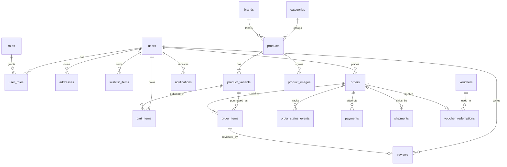

# Thiết kế PostgreSQL cho MiniShop

Schema này là thiết kế dữ liệu của backend MiniShop. Các file SQL được giữ trong backend để quản lý tập trung nhưng hiện vẫn chạy thủ công; Spring Boot không tự chạy chúng khi khởi động. Frontend hiện còn dùng mock data riêng. Thiết kế giả định một cửa hàng MiniShop, không phải marketplace nhiều người bán.

## Chạy

Yêu cầu PostgreSQL 16+ và một database rỗng. Trong thư mục `minishop-server`:

```powershell
createdb -U postgres minishop
psql -U postgres -d minishop -v ON_ERROR_STOP=1 -f database/001_init.sql
psql -U postgres -d minishop -v ON_ERROR_STOP=1 -f database/002_seed_reference.sql
psql -U postgres -d minishop -v ON_ERROR_STOP=1 -f database/003_comments.sql
psql -U postgres -d minishop -v ON_ERROR_STOP=1 -f database/004_auth.sql
psql -U postgres -d minishop -v ON_ERROR_STOP=1 -f database/005_password_reset.sql
psql -U postgres -d minishop -v ON_ERROR_STOP=1 -f database/006_user_roles.sql
```

`001_init.sql` là migration chạy **một lần**; nó tạo schema `minishop` và toàn bộ bảng trong một transaction. `002_seed_reference.sql` là dữ liệu tham chiếu mẫu, có thể chạy lại. Nếu `psql` chưa có trong PATH trên Windows, dùng đường dẫn `C:\Program Files\PostgreSQL\18\bin\psql.exe` tương ứng với bản PostgreSQL đã cài.

`003_comments.sql` mô tả bằng tiếng Việt từng bảng, từng cột và view. Chạy file này sau `001_init.sql`; với database đã có schema, chỉ cần chạy riêng file chú thích. Có thể chạy lại để cập nhật mô tả. Xem chú thích trong `psql` bằng `\d+ minishop.users` (thay `users` bằng tên bảng khác), hoặc xem trường **Comment** trong pgAdmin.

`004_auth.sql` bổ sung bảng mã xác minh email và refresh token; chỉ chạy **một lần** trên database đã có `001_init.sql`. Script này đã được áp dụng cho database local `minishop` trong phiên phát triển auth. Với database khác, chạy sau các file trên; xem [hướng dẫn auth](../docs/AUTH_GUIDE.md).

`005_password_reset.sql` bổ sung bảng mã khôi phục mật khẩu. Database local đã chạy file này; môi trường khác chạy **một lần** sau `004_auth.sql`.

`006_user_roles.sql` bổ sung bảng phân quyền `roles` và `user_roles`. File này gán `CUSTOMER` cho tài khoản có sẵn và tạo trigger để tài khoản mới cũng nhận `CUSTOMER`; **không tự cấp `ADMIN`**. Chạy **một lần** sau `005_password_reset.sql`. Với database đã có các file trước, chỉ cần chạy file 006, không chạy lại `001_init.sql`.

## Quan hệ chính



| Nhóm      | Bảng                                                                                           | Vai trò                                                                     |
| --------- | ---------------------------------------------------------------------------------------------- | --------------------------------------------------------------------------- |
| Tài khoản | `users`, `roles`, `user_roles`, `oauth_accounts`, `user_preferences`, `addresses`              | Danh tính dùng chung, phân quyền, đăng nhập Google sau này, theme và sổ địa chỉ |
| Catalog   | `categories`, `brands`, `products`, `product_variants`, `product_images`                       | Thông tin sản phẩm, SKU, lựa chọn màu/dung lượng, giá và tồn kho            |
| Trang chủ | `banners`, `collections`, `collection_products`, `flash_sale_campaigns`, `flash_sale_variants` | Banner, danh sách gợi ý/được yêu thích và Flash Sale có thời gian/giới hạn  |
| Mua sắm   | `cart_items`, `wishlist_items`, `vouchers`                                                     | Giỏ hàng theo biến thể, yêu thích theo sản phẩm và mã giảm giá              |
| Đơn hàng  | `orders`, `order_items`, `order_status_events`, `payments`, `shipments`, `voucher_redemptions` | Checkout, lịch sử trạng thái, lần thanh toán, vận chuyển, lượt dùng voucher |
| Sau mua   | `reviews`, `review_images`, `notifications`                                                    | Đánh giá từ sản phẩm đã mua và thông báo theo người dùng                    |

Tên bảng đều nằm trong schema `minishop`. `catalog_listing` là view lấy giá của biến thể đang bán rẻ nhất, tổng tồn kho, phần trăm giảm giá và các chỉ số đánh giá để phục vụ danh sách sản phẩm.

## Quy ước dữ liệu

- Khóa chính dùng UUID. Các ID chuỗi hiện có trong mock như `sony-xm5`, `phone`, `popular` trở thành `slug`, không phải UUID. API sẽ trả cả UUID và slug khi cần điều hướng.
- Schema yêu cầu tài khoản khi tạo đơn. Giỏ của khách chưa đăng nhập có thể giữ tạm trên thiết bị, rồi gộp vào `cart_items` sau khi đăng nhập.
- Giá là số nguyên `BIGINT` theo **đồng Việt Nam**, ví dụ `6490000`. Không dùng `float` hay `money` để tính tiền.
- Mỗi tổ hợp thuộc tính có một `product_variants` riêng với `sku`, `attributes` JSONB, giá và tồn kho. Sản phẩm không có lựa chọn vẫn có một biến thể với `attributes = '{}'`.
- `products.rating_average`, `review_count`, `sold_count` là số liệu tổng hợp để đọc nhanh; backend cập nhật khi đơn giao thành công/đánh giá thay đổi. `categories.productCount` trong UI được tính từ sản phẩm thực, không lưu cố định.
- Đơn hàng lưu **bản chụp** tên/giá/SKU/thuộc tính trong `order_items` và thông tin giao hàng trong `orders`. Sửa sản phẩm hoặc địa chỉ sau khi mua không làm thay đổi đơn cũ.
- `addresses_one_default_per_user` bảo đảm tối đa một địa chỉ mặc định mỗi người. Backend đặt địa chỉ đầu tiên làm mặc định và chọn địa chỉ khác khi xóa địa chỉ mặc định.
- `users.password_hash` chỉ chứa hash mật khẩu; không lưu mật khẩu thô. `oauth_accounts` lưu mã định danh từ nhà cung cấp, không lưu mật khẩu Google.
- Mỗi tài khoản luôn có `CUSTOMER`. `STAFF` và `ADMIN` chỉ được cấp qua quy trình nội bộ sau khi xác minh đúng người dùng. Backend phải kiểm tra vai trò ở API quản trị; ẩn menu trên CMS không phải là phân quyền.
- `created_at` và `updated_at` dùng `TIMESTAMPTZ`; API chuyển sang múi giờ Việt Nam khi hiển thị.

## Cấp quyền admin đầu tiên

Không gán admin theo email cố định trong migration. Sau khi xác minh tài khoản cần cấp quyền, thay email ví dụ bằng email tài khoản đã đăng ký và chạy:

```sql
INSERT INTO minishop.user_roles (user_id, role_code)
SELECT id, 'ADMIN'
FROM minishop.users
WHERE lower(email) = lower('admin@example.com') AND status = 'active'
ON CONFLICT (user_id, role_code) DO NOTHING
RETURNING user_id;
```

Lệnh `RETURNING` phải trả về một user ID; nếu không có kết quả, kiểm tra lại email và trạng thái tài khoản. Backend kiểm tra vai trò `ADMIN` trực tiếp từ database cho mỗi request `/api/v1/admin/**`, nên việc thu hồi quyền có hiệu lực mà không cần đợi access token hết hạn.

## Giao dịch checkout cần có ở backend

1. Nhận `checkout_key` duy nhất cho mỗi lần người dùng bấm đặt hàng. Khóa `(user_id, checkout_key)` ngăn tạo đơn đôi khi mạng retry.
2. Mở transaction; đọc các `cart_items` đã chọn và giá biến thể hiện tại. Nếu có Flash Sale, kiểm tra thời gian và giới hạn. Trừ tồn kho bằng cập nhật có điều kiện `WHERE stock_quantity >= :quantity`, rồi kiểm tra số dòng cập nhật.
3. Nếu dùng voucher, khóa dòng voucher (`SELECT ... FOR UPDATE`), kiểm tra hạn, đơn tối thiểu và số lượt sử dụng; ghi `voucher_redemptions` cùng transaction. Khi hủy đơn, đổi trạng thái lượt dùng thành `released` và hoàn tồn kho theo chính sách.
4. Ghi `orders`, `order_items`, sự kiện trạng thái, lần thanh toán ban đầu và thông báo. Tính `subtotal_vnd` từ các dòng đã chốt, tính giảm giá và phí vận chuyển trên server, sau đó commit. Không tin tổng tiền do app gửi lên.
5. Webhook thanh toán cập nhật `payments`/`orders` theo mã giao dịch của nhà cung cấp. Chỉ cho phép các chuyển trạng thái hợp lệ. Mã giao dịch được ràng buộc unique để tránh xử lý trùng.

Các quy tắc liên bảng như tổng tiền đơn bằng tổng `order_items`, người viết đánh giá phải sở hữu đơn đã giao, giá Flash Sale phải thấp hơn giá thường, và số lượt voucher theo mỗi người cần được xác thực trong service/transaction của backend. Check constraint không phù hợp để đọc các dòng khác. Chỉ số `rating_average` và `sold_count` cũng cần quy trình cập nhật rõ ràng.

## Ví dụ truy vấn

```sql
SELECT slug, name, price_vnd, original_price_vnd, discount_percent,
       rating_average, sold_count, stock_quantity
FROM minishop.catalog_listing
WHERE status = 'active' AND category_id = :category_id
ORDER BY sold_count DESC
LIMIT 20;

SELECT order_code, status, total_vnd, created_at
FROM minishop.orders
WHERE user_id = :user_id
ORDER BY created_at DESC
LIMIT 20;
```

Tham số `:category_id` và `:user_id` trong ví dụ là placeholder của backend, không phải cú pháp chạy trực tiếp trong `psql`.

Tham khảo PostgreSQL: [UUID](https://www.postgresql.org/docs/current/functions-uuid.html), [ràng buộc và khóa ngoại](https://www.postgresql.org/docs/current/ddl-constraints.html), [partial index](https://www.postgresql.org/docs/current/indexes-partial.html).
